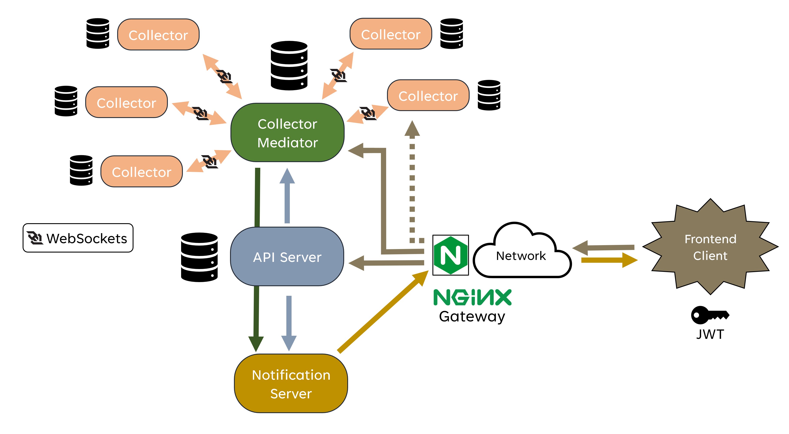

# CSCI-495 Capstone Project

Electronic Voting Protocol

 

## Directory Layout

The code is laid out as a [monorepo](https://en.wikipedia.org/wiki/Monorepo) with the following subdirectories:

- [`/server`](/server) - Code for REST API server
- [`/mediator`](/mediator) - Code for the collector mediator
- [`/collector`](/collector) - Code for collector
- [`/notifications`](/notifications) - Code for websocket notification server
- [`/shared`](/shared) - Shared code between the server, mediator, collector, and notifications
- [`/frontend`](/frontend) - TypeScript code for single-page application

See the `README.md` file in each subdirectory for directions on compiling and running the code.

 

## System Architecture

- **API Server** - [REST server](https://en.wikipedia.org/wiki/Representational_state_transfer) that manages various website details such as user accounts, election details, registrations, etc.
- **Collector Mediator** - Facilitates WebSocket communication between the different collectors
- **Collectors** - Verifies the ballots, uses WebSocket messages for communication
- **Notification Server** - Pushes real-time updates to the frontend using WebSocket messages
- **Frontend Client** - [Single-page application](https://en.wikipedia.org/wiki/Single-page_application) running in the browser

Authentication and authorization is handled using [JSON Web Tokens](https://jwt.io/).
The API server, mediator, and collectors connect to [PostgreSQL Databases](https://www.postgresql.org/) for storage.
[NGINX](https://www.nginx.com/) is used as a gateway between the backend services and the frontend.
NGINX also communicates with the mediator to proxy a collector UUID directly to the service (dotted line).
See the [frontend README.md](/frontend/README.md) file for details on properly configuring NGINX.

 

## Credits

The TruBallot frontend, backend, collectors, and notification server have been programmed by Bryan McClain for his senior capstone project.
The voting protocol comes from a [2017 Paper by Zou et al](https://www.mdpi.com/2410-387X/1/2/13).
Bryan worked with Dr. Zou (capstone advisor) during this project to ensure the math was implemented correctly.
The TruBallot icon and logo were designed by Nathan McClain.
